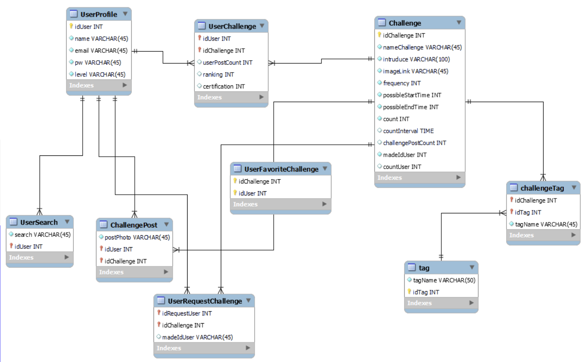

## ttc_java
TimeToCode 앱은 꾸준한 프로그래밍 공부 습관을 만들기 위해 커뮤니티 형식으로 동기를 부여해주고 행동력을 높여주기 위한 프로젝트이다.  
Spring boot 프로젝트는 안드로이드 앱과 HTTP 통신을 위한 프로젝트이다.

### 자바 코드 작성시 주의 사항
구름은 기본 위치가 정해져 있기 때문에 /src/main/java 이후를 기준으로 패키지 위치를 작성해야 함.
예시로 project.model을 참고.

### 프로젝트 실행시 주의 사항
application.properties와 pom.xml파일 내용을 변경해야 함

### 개발 환경
**Java**

9                                                                                                 
_____________________________
**Maven**

3.3.9                                                                                           
_____________________________
**Gradle**

4.6                                                                                              
_____________________________
**Spring Boot**

2.0.1                                                                                           
_____________________________
**MySql**

8
_____________________________

### MySQL ERD

### 간단한 프로젝트 개발 설명
만들어야 하는 자바 파일은 controller, mapper, model 세 가지로 나눌 수 있다.  
controller는 http 요청을 듣고 응답해주는 역할이다

mapper는 controller에서 sql문을 출력을 위한 것이다.

model은 sql문 출력문을 저장하거나 json 형태로 http 응답에 이용되기 위한 것이다.
